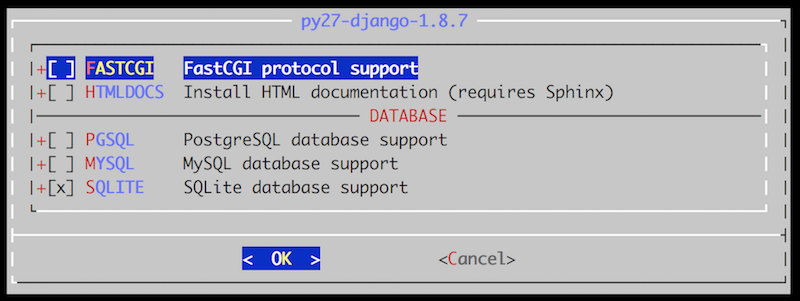

class: center, middle

## The FreeBSD ports & pkg System
### Developer's Perspective

Li-Wen Hsu &lt;lwhsu@FreeBSD.org&gt;

---


.footnote[https://lwhsu.github.io/talk-20160730-bsddaytw_ports_dev/]

---
# Package management

- Install 3rd party softwares

---
# About FreeBSD Ports

https://en.wikipedia.org/wiki/FreeBSD_Ports

- **Jordan Hubbard** committed his port make macros to the FreeBSD CVS repository on August 21, 1994.
  * https://svnweb.freebsd.org/changeset/ports/5
  * https://svnweb.freebsd.org/ports/head/Mk/bsd.port.mk?revision=5&view=markup&pathrev=5#l28

- Src people make FreeBSD, ports pople make FreeBSD useful

---
# About FreeBSD Package

- Package
- Pkgng
- Pkg

https://man.FreeBSD.org/pkg

---
# Porter's Handbook

https://www.freebsd.org/doc/en_US.ISO8859-1/books/porters-handbook/

---
# Ports Tree

```
$ ls /usr/ports
.arcconfig       Templates/       devel/           mail/            shells/
.gitattributes   Tools/           dns/             math/            sysutils/
.gitignore       UIDs             editors/         misc/            textproc/
.portsnap.INDEX  UPDATING         emulators/       multimedia/      ukrainian/
CHANGES          accessibility/   finance/         net/             vietnamese/
CONTRIBUTING.md  arabic/          french/          net-im/          www/
COPYRIGHT        archivers/       ftp/             net-mgmt/        x11/
GIDs             astro/           games/           net-p2p/         x11-clocks/
INDEX-10         audio/           german/          news/            x11-drivers/
INDEX-8          benchmarks/      graphics/        palm/            x11-fm/
INDEX-9          biology/         hebrew/          polish/          x11-fonts/
Keywords/        cad/             hungarian/       ports-mgmt/      x11-servers/
LEGAL            chinese/         irc/             portuguese/      x11-themes/
MOVED            comms/           japanese/        print/           x11-toolkits/
Makefile         converters/      java/            russian/         x11-wm/
Mk/              databases/       korean/          science/
README           deskutils/       lang/            security/
```

---
# A Port

- Makefile
- distinfo
- files/
- pkg-descr
- pkg-plist

---
# Become a Ports Developer!

````sh
echo DEVELOPER=yes >> /etc/make.conf
````

---
# Quick Porting

- Writing the Makefile
- Writing the Description Files
- Creating the Checksum File
- Testing the Port
- Checking with portlint
- Submitting the New Port

---
# Makefile

```Makefile
# $FreeBSD$

PORTNAME=       oneko
PORTVERSION=    1.1b
CATEGORIES=     games
MASTER_SITES=   ftp://ftp.cs.columbia.edu/archives/X11R5/contrib/

MAINTAINER=     youremail@example.com
COMMENT=        Cat chasing a mouse all over the screen

.include <bsd.port.mk>
```

(Using space for formatting, but port Makefile should use tab with 8 as width)

.right[]

---
# pkg-descr

```
This is a port of oneko, in which a cat chases a poor mouse all over
the screen.
 :
(etc.)

WWW: http://www.oneko.org/
```

---
# pkg-plist

```
bin/oneko
man/man1/oneko.1.gz
lib/X11/app-defaults/Oneko
lib/X11/oneko/cat1.xpm
lib/X11/oneko/cat2.xpm
lib/X11/oneko/mouse.xpm
```

- `PLIST_FILES=` in `Makefile`
- Sorting
   * file `sort`
   * directory `sort -r`
- `make makeplist`

---
# Checksum File (distinfo)

- `make fetch`
- `make makesum`

```
SHA256 (oneko/oneko-2.0b.tar.gz) = 6d106cd38134be5f5c483affe7fe3b64f8a92955e88097040472571a3f1deb46
SIZE (oneko/oneko-2.0b.tar.gz) = 86353
SHA256 (oneko/oneko-2.0b-pop1.1-patch.tar.gz) = 36cedd96d0219fb687fed0c34bbdf375833a3ce0f6d12220427fbc804b315681
SIZE (oneko/oneko-2.0b-pop1.1-patch.tar.gz) = 17861
SHA256 (oneko/oneko-2.0b-tip1.7.tar.gz) = 91896db954c7b18e63f913ef264adfb9f297763f0cb8c0c7dc832b701c808c13
SIZE (oneko/oneko-2.0b-tip1.7.tar.gz) = 64251
SHA256 (oneko/oneko-2.0b-sender0.5.tar.gz) = 2bd346b124812706b98481baea5b66a8e73added466a6880194bc52b20090113
SIZE (oneko/oneko-2.0b-sender0.5.tar.gz) = 42944
SHA256 (oneko/oneko-2.0b-bsd0.2.tar.gz) = 2c876387cb7d654bdd4bec5abb273dd98e35fe505bf169f92847f37fafe0d83e
SIZE (oneko/oneko-2.0b-bsd0.2.tar.gz) = 22029
```

---
# Check lists

- Software works correctly
- `pkg-plist`
    * Does not contain anything not installed by the port.
    * Contains everything that is installed by the port.
- `make install`
    * Verify the install script works correctly
- `make deinstall`
    * Verify the deinstall script works correctly
- **Only** `make fetch` need to access network
    * Important for package builders
- `make package` can be run as a normal user (that is, not as root).
    * If that fails, `NEED_ROOT=yes` must be added to the port Makefile

---
# Testing steps

0. `make stage`
0. `make check-orphans`
0. `make package`
0. `make install`
0. `make deinstall`
0. `pkg add <package-filename>`
0. `make package (as user)`

---
# Checking with portlint

### `$ portlint -abct`

Do **not** **blindly** follow the output of `portlint`

```
$ cd /usr/ports/devel/jenkins && portlint -abct
WARN: Makefile: possible use of absolute pathname "/var/log/jenkins.log".
0 fatal errors and 1 warning found.
```

---
# Submitting

### Now Port (use shar):
```
shar `find oneko` > oneko.shar
```

### Updating (use patch):
```
svn diff > port.diff
```
---
# Bugzilla
- https://bugs.freebsd.org/submit/
  * "Ports & Packages"
  * "Individual Port(s)"
  * Prefix the issue **Summary** field with `category/port`
      - so that MAINTAINER is Assigned or CC'd automatically.
  * Add an attachment
  * Test build log

---
# Work with other Committers and Contributors

- When waiting respose, submit another patch!
- Additional FreeBSD Contributors
  * https://www.freebsd.org/doc/en_US.ISO8859-1/articles/contributors/contrib-additional.html
- Maintainer timeout
- Maintainership takeove

---
# More complex example

### www/py-django

https://svnweb.freebsd.org/ports/head/www/py-django/Makefile?view=markup

- MASTER_SITES macros
- PKGNAMEPREFIX
- DISTNAME
- DIST_SUBDIR

- CONFLICTS

---
# Behind `make all install`
- Default sequence for `all` target:

  * check-sanity
  * fetch
  * checksum
  * extract
  * patch
  * configure
  * build

- `install` depends:
  * stage
  * package
  * install

---
# Each standard target

### pre-\* do-\* post-\*

Examples:
- pre-configure:
  ```
  ${CHMOD} +x ${WRKSRC}/configure
  ```
- do-install:
  ```
  ${INSTALL_SCRIPT} ${WRKSRC}/${PORTNAME}.pl \
	  ${STAGEDIR}${PREFIX}/bin/${PORTNAME}
  ```
- post-extract:
  ```
  @${FIND} ${WRKSRC} -type f \( -name '*.bak' -or \
	  -name '*.dll' -or -name '*.exe' \) -delete
  ```

---
# fetch

- Execute `fetch(1)`
- fetch `${DISTNAME}${EXTRACT_SUFX}`
- FETCH_ARGS

---
# extract

- EXTRACT_CMD
- USES=
  * tar:bzip2
  * tar:xz
  * Affects EXTRACT_SUFX

---
# patch

- EXTRA_PATCHES
  * https://svnweb.freebsd.org/ports/head/www/npm/Makefile?revision=415659&view=markup#l38

- External patch
  * https://svnweb.freebsd.org/ports/head/devel/cvs2svn/Makefile?revision=412627&view=markup#l11
  * PATCHFILES
  * PATCH_SITES

---
# configure

https://svnweb.freebsd.org/ports/head/lang/python27/Makefile?revision=417945&view=markup#l17

- CONFIGURE_ARGS
- CONFIGURE_ENV
- CONFIGURE_SCRIPT
- HAS_CONFIGURE
- GNU_CONFIGURE

---
# build & install

https://svnweb.freebsd.org/ports/head/devel/jenkins/Makefile?revision=419032&view=markup#l49

- ALL_TARGET
- MAKE_JOBS_UNSAFE

- INSTALL_TARGET

---
# test

Not executed by default

https://svnweb.freebsd.org/ports/head/www/lighttpd/Makefile?revision=418900&view=markup#l190

- TEST_TARGET

---
# More targets in `bsd.port.mk`

Find "More standard targets start here."
- pre-everything::

---
# UID/GID

https://svnweb.freebsd.org/ports/head/devel/jenkins/Makefile?revision=419032&view=markup#l33

- ports/UIDs
- ports/GIDs 

.footnote[https://www.freebsd.org/doc/en_US.ISO8859-1/books/porters-handbook/users-and-groups.html]

---
# Testing

---
# Staging

https://svnweb.freebsd.org/ports/head/devel/jenkins/Makefile?revision=419032&view=markup#l49

- https://www.freebsd.org/doc/en_US.ISO8859-1/books/porters-handbook/special.html#staging
- https://wiki.freebsd.org/ports/StageDir

---
# USE

https://www.freebsd.org/doc/en_US.ISO8859-1/books/porters-handbook/uses.html#uses-intro

- https://svnweb.freebsd.org/ports/head/Mk/Uses/
- https://svnweb.freebsd.org/ports/head/Mk/Uses/compiler.mk?view=markup
- https://svnweb.freebsd.org/ports/head/Mk/Uses/autoreconf.mk?view=markup

--
# SUB

https://svnweb.freebsd.org/ports/head/devel/jenkins/Makefile?revision=419032&view=markup#l39

- SUB_FILES
- SUB_LIST
- PLIST_SUB

.footnote[https://www.freebsd.org/doc/en_US.ISO8859-1/books/porters-handbook/using-sub-files.html]

---
# Compiler and flags

- CC
- CFLAGS
- CXX
- CXXFLAGS

```Makfile
${REINPLACE_CMD} -e 's|-O3|${CXXFLAGS}|;s|g++|${CXX}|' Makefile
```

---
# Master Sites

- MASTER_SITES
- MASTER_SITE_SUBDIR

- https://svnweb.freebsd.org/ports/head/Mk/bsd.sites.mk?view=markup

---
# *DIR

- MASTERDIR
- PORTSDIR
- DISTDIR
- WRKDIRPREFIX
- WRKDIR
- WRKSRC
  * *_WRKSRC
- PATCHDIR
- SCRIPTDIR
- FILESDIR
- PKGDIR
- SRC_BASE

---
# *_DEPENDS

https://svnweb.freebsd.org/ports/head/devel/py-jenkins-job-builder/Makefile?revision=418472&view=markup#l16

- EXTRACT_DEPENDS
- PATCH_DEPENDS
- FETCH_DEPENDS
- BUILD_DEPENDS
- RUN_DEPENDS
- LIB_DEPENDS
- TEST_DEPENDS

---
# CONFLICTS

Ports install files in the same place should be marked CONFLICTS

https://svnweb.freebsd.org/ports/head/www/py-django/Makefile?revision=412351&view=markup#l24

---
# USE_GITHUB

---
# License

https://svnweb.freebsd.org/ports/head/www/py-django/Makefile?revision=412351&view=markup#l16

- https://svnweb.freebsd.org/ports/head/Mk/bsd.licenses.mk?view=markup
- https://svnweb.freebsd.org/ports/head/Mk/bsd.licenses.db.mk?view=markup
- EULA
  * https://svnweb.freebsd.org/ports/head/net-p2p/btsync/Makefile?view=markup#l13

---
# OPTIONS

`make config`



---
# OPTIONS (c.)

### www/py-django

https://svnweb.freebsd.org/ports/head/www/py-django/Makefile?view=markup

- OPTIONS_DEFINE
- OPTIONS_DEFAULT
- OPTIONS_GROUP
- [OPT]_DESC
- [OPT]_\*_DEPENDS

---
# OPTIONS (c.)

- `.include <bsd.port.options.mk>`

- `TARGET-OPT-on` and `TARGET-OPT-off`
  * `pre-patch-COMPRESSED_FOLDERS-on`

- `.if ${PORT_OPTIONS:M[OPT]}`

.footnote[https://www.freebsd.org/doc/en_US.ISO8859-1/books/porters-handbook/makefile-options.html]

---
# RC script

https://svnweb.freebsd.org/ports/head/devel/jenkins/Makefile?view=markup

https://svnweb.freebsd.org/ports/head/devel/jenkins/files/jenkins.in?view=markup

---
# BROKEN

- Fix ASAP
- Really cannot fix, mark IGNORE

---
# Other files under ports/

- CHANGES
- LEGAL
- MOVED
- UPDATING

---
# Paths

- LOCALBASE
  * Where ports install things
  * Default: /usr/local
- LINUXBASE
  * Where Linux ports install things
  * Default: `/compat/linux`
- PREFIX
  * Where *this* port installs its files.
  * Default: ${LINUXBASE} if USE_LINUX_PREFIX is set, otherwise ${LOCALBASE}

---
# INSTALL_* & COPYTREE_*

- INSTALL_PROGRAM
- INSTALL_KLD
- INSTALL_LIB
- INSTALL_SCRIPT
- INSTALL_DATA
- INSTALL_MAN

- COPYTREE_BIN
- COPYTREE_SHARE

---
# Doc & Examples & Data

- PORTDOCS
  * DOCSDIR
- PORTEXAMPLES
  * EXAMPLESDIR
- PORTDATA
  * DATADIR

---
# handy pkg commands
- grep -r
- make -V
- pkg version -t

---
# Utilities

- ports-mgmt/porttools
- ports-mgmt/portlint

- bz

---
# Submit your work

- New porrt
- Patch

---
# Special port type

- slave port
- meta port

---
# Language specific ports

- Perl
- Python
- Ruby
- Haskell

---
# FreeBSD.org web services

- https://bugs.FreeBSD.org
- https://reviews.FreeBSD.org
- http://portscout.FreeBSD.org/

- Redports

---
# Best Practices

- Dos and Don'ts
    * https://www.freebsd.org/doc/en_US.ISO8859-1/books/porters-handbook/porting-dads.html

---
# VuXML

- http://www.vuxml.org/freebsd/ \

---
# References

- Mk/bsd.pot.Mk
  * https://svnweb.freebsd.org/ports/head/Mk/bsd.port.mk?view=markup

---
# Possible target as 2016/07/30
